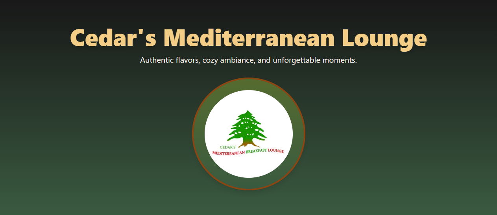

# Cedars Mediterranean Lounge



This is a responsive and SEO-optimized website for Cedars Mediterranean Lounge, a restaurant offering "Authentic flavors, cozy ambiance, and unforgettable moments". The site was developed to enhance the restaurant's online presence and drive customer engagement.

The project was engineered with Next.js, TypeScript, and Tailwind CSS.

## Features

- **Responsive Design**: A mobile-first approach ensures a seamless user experience on all devices, from desktops to smartphones.
- **Catering & Menu Pages**: The website includes detailed pages for menus and catering services, as indicated by recent updates.

## Tech Stack

- **Framework**: Next.js
- **Language**: TypeScript
- **Styling**: Tailwind CSS & PostCSS
- **Database**: PostgreSQL
- **Linting**: ESLint
- **Package Manager**: pnpm

## Getting Started

Follow these instructions to get a local copy up and running for development and testing purposes.

### Prerequisites

Make sure you have Node.js and pnpm installed on your machine.

- [Node.js](https://nodejs.org/)
- [pnpm](https://pnpm.io/installation)

### Installation

1.  **Clone the repository:**
    ```sh
    git clone [https://github.com/RyanHermes/cedars-mediterranean-lounge.git](https://github.com/RyanHermes/cedars-mediterranean-lounge.git)
    ```
2.  **Navigate to the project directory:**
    ```sh
    cd cedars-mediterranean-lounge
    ```
3.  **Install dependencies:**
    The repository uses `pnpm`, as indicated by the `pnpm-lock.yaml` file.
    ```sh
    pnpm install
    ```
4.  **Set up environment variables:**
    Create a `.env.local` file in the root of the project and add the necessary environment variables, such as your database connection string.
    ```env
    POSTGRES_URL="your_database_connection_string"
    ```
5.  **Run the development server:**
    ```sh
    pnpm dev
    ```
6.  Open [http://localhost:3000](http://localhost:3000) with your browser to see the result.

## Contact

Ryan Hermes

- **Email**: ryanhermes@pm.me
- **Website**: [ryanhermes.ca](https://ryanhermes.ca)
- **LinkedIn**: [linkedin.com/in/ryan--hermes](https://linkedin.com/in/ryan--hermes)
