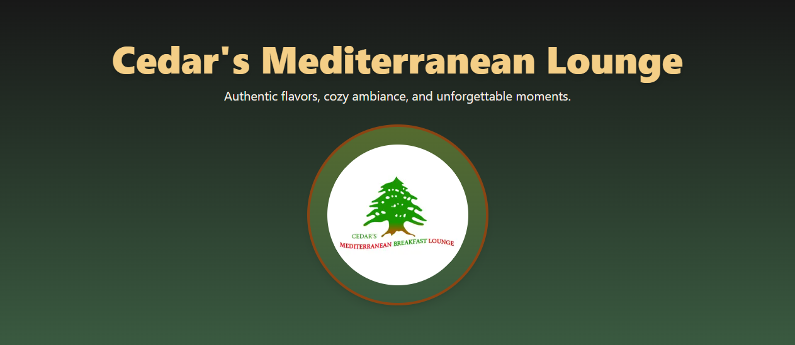

# Cedar's Mediterranean Lounge



Marketing site for [Cedar's Mediterranean Lounge](https://cedarsmediterraneanlounge.ca), an authentic Mediterranean restaurant in Windsor, Ontario.

## Tech Stack

- **Framework**: Next.js 15 (App Router) + TypeScript
- **Styling**: Tailwind CSS
- **Carousel**: Swiper
- **Hosting**: Vercel
- **Analytics**: `@vercel/analytics`

## Local Development

The toolchain (Node + pnpm) is pinned via `mise.toml`. Install [mise](https://mise.jdx.dev/) once, then:

```sh
mise install   # installs the pinned Node + pnpm versions
pnpm install   # installs JS dependencies
pnpm dev       # starts the dev server at http://localhost:3000
```

If you don't use mise, install Node 22.x and pnpm 10.x manually.

## Deployment

Push to `main` deploys to production via Vercel. Preview deployments are created automatically for every PR.

## Repo Map

- `app/` — App Router pages (`/`, `/catering`, `/hall-rental`), `layout.tsx`, `globals.css`, `sitemap.ts`, `robots.ts`
- `components/` — Shared client components (`AppHeader`, `Carousel`)
- `public/assets/` — Images, icons, videos
- `mise.toml` — Pinned tool versions
- `next.config.ts` — Next.js configuration

## Contact

Maintained by [Ryan Hermes](https://ryanhermes.ca) — ryanhermes@pm.me
